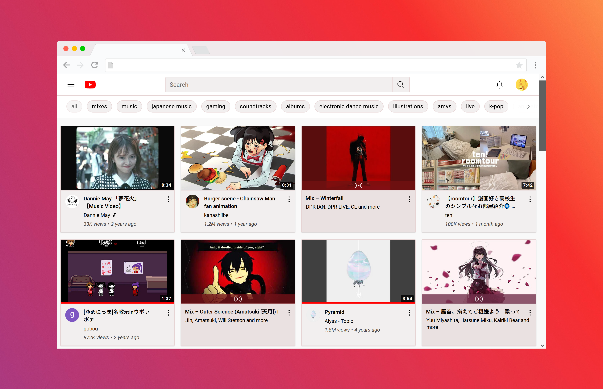
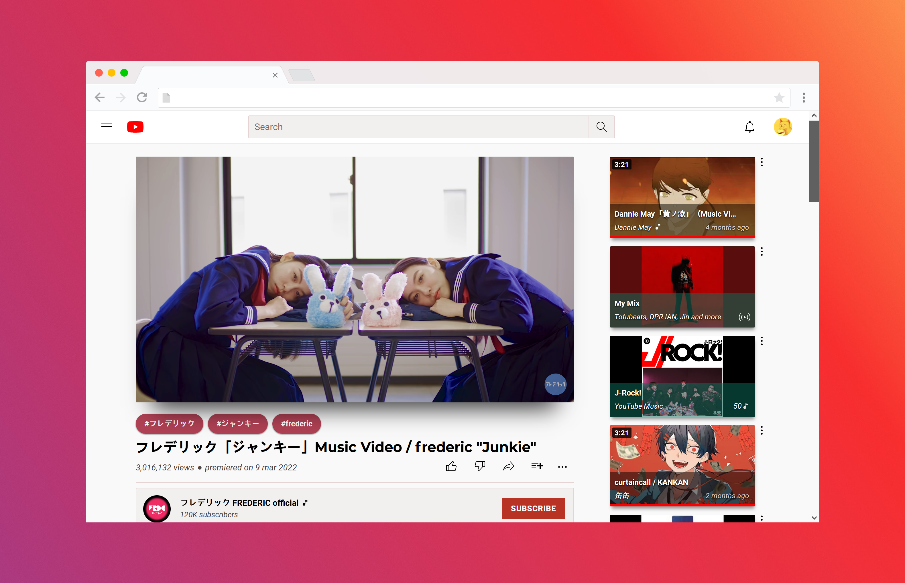
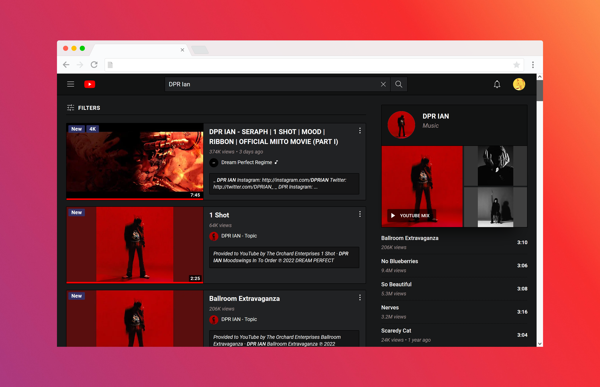
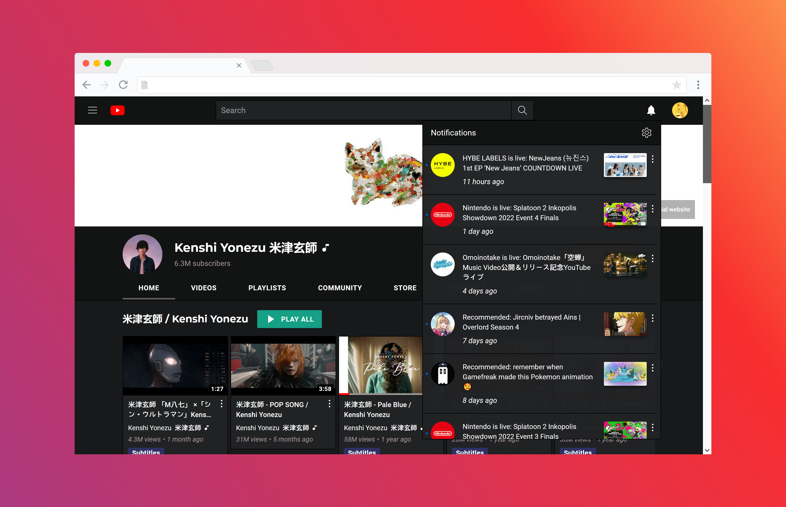

# Youtube.usercss

About
-------------------------------

A css script for <i><a href="https://youtube.com/">Youtube.com</a></i>.

There are two themes available : <i>Classic</i> and <i>Dark Cyan</i>.

Instruction
-------------------------------

<strong>Step 1 : Install Stylus</strong> 

Depending of your browser.
+ for <a href="https://addons.mozilla.org/en-US/firefox/addon/styl-us/">Mozilla Firefox</a></li>
+ for <a href="https://chrome.google.com/webstore/detail/stylus/clngdbkpkpeebahjckkjfobafhncgmne?hl=en">Google Chrome</a>

<strong>Step 2 : Install the script </strong>
+ Directly with <b>Stylus</b> : <a href="https://raw.githubusercontent.com/Catgrills/Youtube.usercss/master/youtube.user.css">click here</a>

<strong>Step 3 : Install font(s) </strong>

<ol>
<li> <a href="http://www.freejapanesefont.com/bokutachi-gothic-2-bold/">Bokutachi no Gothic 2 </a></li>
<li> <a href="https://www.fontsquirrel.com/fonts/montserrat">Montserrat</a></li>
<li> <a href="https://www.fontsquirrel.com/fonts/roboto">Roboto</a></li>
</ol>

Report
-------------------------------

Don't hesitate to report any issues you find while using this script.
